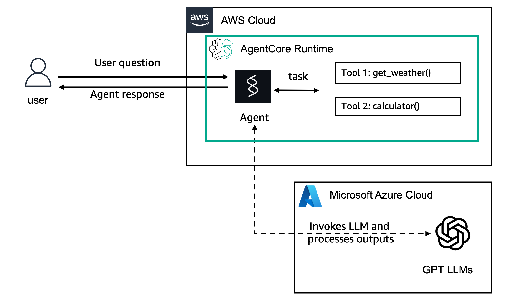

# Amazon Bedrock AgentCore Runtime에서 OpenAI 모델을 사용한 Strands Agents 호스팅

## 개요

이 튜토리얼에서는 Amazon Bedrock AgentCore Runtime을 사용하여 기존 에이전트를 호스팅하는 방법을 학습합니다.

OpenAI 모델을 사용한 Strands Agents 예제에 중점을 둡니다. Amazon Bedrock 모델을 사용한 Strands Agents는 [여기](../01-strands-with-bedrock-model)를 확인하고, Amazon Bedrock 모델을 사용한 LangGraph는 [여기](../02-langgraph-with-bedrock-model)를 확인하세요.

### 튜토리얼 세부 정보

| 정보         | 세부 사항                                                                  |
|:--------------------|:-------------------------------------------------------------------------|
| 튜토리얼 유형       | 대화형                                                           |
| 에이전트 유형          | 단일                                                                   |
| 에이전트 프레임워크   | Strands Agents                                                           |
| LLM 모델           | GPT 4.1 mini                                                             |
| 튜토리얼 구성 요소 | AgentCore Runtime에서 에이전트 호스팅. Strands Agent 및 OpenAI Model 사용 |
| 튜토리얼 분야   | 교차 분야                                                           |
| 예제 복잡성  | 쉬움                                                                     |
| 사용된 SDK            | Amazon BedrockAgentCore Python SDK 및 boto3                             |

### 튜토리얼 아키텍처

이 튜토리얼에서는 기존 에이전트를 AgentCore 런타임에 배포하는 방법을 설명합니다.

데모 목적으로 Amazon Bedrock 모델을 사용하는 Strands Agent를 사용합니다.

예제에서는 `get_weather`와 `get_time`이라는 두 가지 도구가 있는 매우 간단한 에이전트를 사용합니다.

    

### 튜토리얼 주요 기능

* Amazon Bedrock AgentCore Runtime에서 에이전트 호스팅
* OpenAI 모델 사용
* Strands Agents 사용