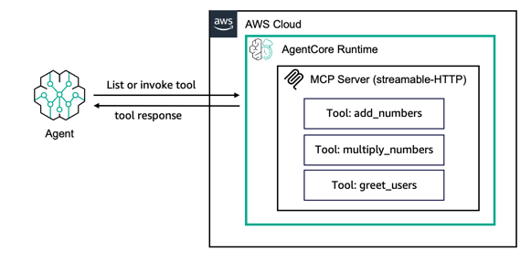

# AgentCore Runtime에서 MCP 서버 호스팅

## 개요

이 세션에서는 Amazon Bedrock AgentCore Runtime에서 MCP 도구를 호스팅하는 방법에 대해 논의합니다.

Amazon Bedrock AgentCore Python SDK를 사용하여 에이전트 함수를 Amazon Bedrock AgentCore와 호환되는 MCP 서버로 래핑합니다.
MCP 서버 세부 사항을 처리하므로 에이전트의 핵심 기능에 집중할 수 있습니다.

Amazon Bedrock AgentCore Python SDK는 에이전트 또는 도구 코드가 AgentCore Runtime에서 실행되도록 준비합니다.

코드를 AgentCore 표준화된 HTTP 프로토콜 또는 MCP 프로토콜 계약으로 변환하여 전통적인 요청/응답 패턴(HTTP 프로토콜) 또는 도구 및 에이전트 서버를 위한 Model Context Protocol(MCP 프로토콜)에 대한 직접 REST API 엔드포인트 통신을 허용합니다.

도구를 호스팅할 때 Amazon Bedrock AgentCore Python SDK는 [세션 격리](https://modelcontextprotocol.io/specification/2025-06-18/basic/transports#session-management)를 위한 `MCP-Session-Id` 헤더와 함께 [Stateless Streamable HTTP] 전송 프로토콜을 구현합니다. 서버는 플랫폼에서 생성된 Mcp-Session-Id 헤더를 거부하지 않도록 상태 비저장 작업을 지원해야 합니다.
그러면 MCP 서버가 포트 `8000`에서 호스팅되고 하나의 호출 경로인 `mcp-POST`를 제공합니다. 이 상호 작용 엔드포인트는 MCP RPC 메시지를 수신하고 도구의 기능을 통해 처리합니다. application/json과 text/event-stream을 모두 응답 콘텐츠 유형으로 지원합니다.

AgentCore 프로토콜을 MCP로 설정하면 AgentCore Runtime은 MCP 서버 컨테이너가 `0.0.0.0:8000/mcp` 경로에 있을 것으로 예상합니다. 이는 대부분의 공식 MCP 서버 SDK에서 지원하는 기본 경로이기 때문입니다.

AgentCore Runtime은 기본적으로 세션 격리를 제공하고 없는 요청에 대해 자동으로 Mcp-Session-Id 헤더를 추가하므로 상태 비저장 스트리밍 가능한 http 서버를 호스팅해야 합니다. 따라서 MCP 클라이언트는 동일한 Bedrock AgentCore Runtime 세션 ID에 대한 연결 연속성을 가질 수 있습니다.

`InvokeAgentRuntime` API의 페이로드는 완전히 통과되므로 MCP와 같은 프로토콜의 RPC 메시지를 쉽게 프록시할 수 있습니다.

이 튜토리얼에서는 다음을 학습합니다:

* 도구가 있는 MCP 서버를 만드는 방법
* 서버를 로컬에서 테스트하는 방법
* 서버를 AWS에 배포하는 방법
* 배포된 서버를 호출하는 방법

### 튜토리얼 세부 정보

| 정보         | 세부 사항                                                   |
|:--------------------|:----------------------------------------------------------|
| 튜토리얼 유형       | 도구 호스팅                                             |
| 도구 유형           | MCP 서버                                                |
| 튜토리얼 구성 요소 | AgentCore Runtime에서 도구 호스팅. MCP 서버 생성 |
| 튜토리얼 분야   | 교차 분야                                            |
| 예제 복잡성  | 쉬움                                                      |
| 사용된 SDK            | Amazon BedrockAgentCore Python SDK 및 MCP Client         |

### 튜토리얼 아키텍처
이 튜토리얼에서는 기존 MCP 서버를 AgentCore 런타임에 배포하는 방법을 설명합니다.

데모 목적으로 `add_numbers`, `multiply_numbers` 및 `greet_users`라는 3가지 도구가 있는 매우 간단한 MCP 서버를 사용합니다.

### 튜토리얼 주요 기능

* MCP 서버 호스팅