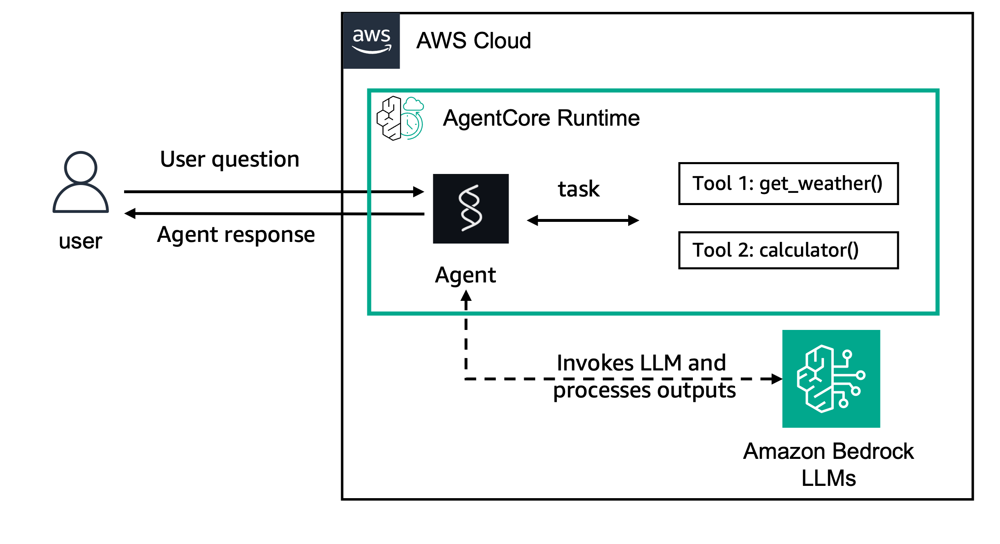

# Amazon Bedrock AgentCore Runtime에서 Strands Agents와 Amazon Bedrock 모델을 사용한 스트리밍 응답

## 개요

이 튜토리얼에서는 기존 에이전트와 함께 Amazon Bedrock AgentCore Runtime을 사용하여 스트리밍 응답을 구현하는 방법을 학습합니다.

실시간 스트리밍 기능을 보여주는 Amazon Bedrock 모델을 사용한 Strands Agents 예제에 중점을 둡니다.

### 튜토리얼 세부 정보

| 정보         | 세부 사항                                                                          |
|:--------------------|:---------------------------------------------------------------------------------|
| 튜토리얼 유형       | 스트리밍을 사용한 대화형                                                    |
| 에이전트 유형          | 단일                                                                           |
| 에이전트 프레임워크   | Strands Agents                                                                   |
| LLM 모델           | Anthropic Claude Sonnet 3.7                                                      |
| 튜토리얼 구성 요소 | AgentCore Runtime을 사용한 스트리밍 응답. Strands Agent 및 Amazon Bedrock Model 사용 |
| 튜토리얼 분야   | 교차 분야                                                                   |
| 예제 복잡성  | 쉬움                                                                             |
| 사용된 SDK            | Amazon BedrockAgentCore Python SDK 및 boto3                                     |

### 튜토리얼 아키텍처

이 튜토리얼에서는 스트리밍 에이전트를 AgentCore 런타임에 배포하는 방법을 설명합니다.

데모 목적으로 스트리밍 기능을 갖춘 Amazon Bedrock 모델을 사용하는 Strands Agent를 사용합니다.

예제에서는 `get_weather`, `get_time`, `calculator`라는 세 가지 도구가 있는 간단한 에이전트를 사용하지만 실시간 스트리밍 응답 기능으로 향상되었습니다.

    

### 튜토리얼 주요 기능

* Amazon Bedrock AgentCore Runtime에서 스트리밍 응답 구현
* Server-Sent Events(SSE)를 사용한 실시간 부분 결과 전달
* 스트리밍 기능을 갖춘 Amazon Bedrock 모델 사용
* 비동기 스트리밍 지원을 갖춘 Strands Agents 사용
* 점진적 응답 표시로 향상된 사용자 경험
