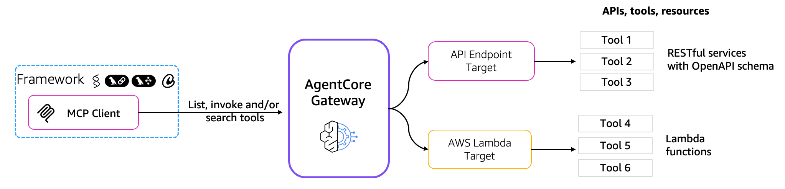
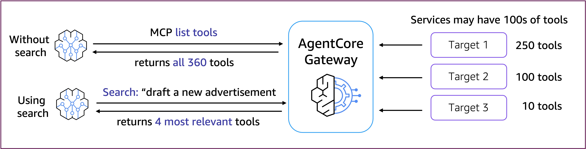

# Amazon Bedrock AgentCore Gateway - 의미 검색

## 튜토리얼 아키텍처

Amazon Bedrock AgentCore Gateway는 에이전트와 상호 작용해야 하는 도구 및 리소스 간의 통합 연결을 제공합니다. Gateway는 이 연결 계층에서 여러 역할을 수행합니다:

1. **보안 가드**: Gateway는 OAuth 권한 부여를 관리하여 유효한 사용자/에이전트만 도구/리소스에 액세스할 수 있도록 합니다.
2. **번역기**: Gateway는 Model Context Protocol(MCP)과 같은 인기 있는 프로토콜을 사용하여 만든 에이전트 요청을 API 요청 및 Lambda 호출로 번역합니다. 이는 개발자가 서버를 호스팅하거나 프로토콜 통합, 버전 지원, 버전 패치 등을 관리할 필요가 없음을 의미합니다.
3. **작곡가**: Gateway는 개발자가 여러 API, 함수 및 도구를 에이전트가 사용할 수 있는 단일 MCP 엔드포인트로 원활하게 결합할 수 있도록 합니다.
4. **키체인**: Gateway는 올바른 도구와 함께 사용할 올바른 자격 증명의 주입을 처리하여 에이전트가 다른 자격 증명 세트가 필요한 도구를 원활하게 활용할 수 있도록 합니다.
5. **연구원**: Gateway는 에이전트가 모든 도구를 검색하여 주어진 컨텍스트나 질문에 가장 적합한 도구만 찾을 수 있도록 합니다. 이를 통해 에이전트는 소수가 아닌 수천 개의 도구를 사용할 수 있습니다. 또한 에이전트의 LLM 프롬프트에 제공해야 하는 도구 세트를 최소화하여 지연 시간과 비용을 줄입니다.
6. **인프라 관리자**: Gateway는 완전히 서버리스이며 내장된 관찰 가능성과 감사 기능을 제공하여 개발자가 에이전트와 도구를 통합하기 위해 추가 인프라를 관리할 필요를 없앱니다.

## AgentCore Gateway는 많은 수의 도구를 가진 MCP 서버의 문제를 해결하는 데 도움이 됩니다

일반적인 엔터프라이즈 환경에서 에이전트 빌더는 수백 또는 수천 개의 MCP 도구를 가진 MCP 서버를 만납니다. 이러한 도구의 양은 도구 선택 정확도 저하, 비용 증가, 과도한 도구 메타데이터로 인한 높은 토큰 사용량으로 인한 지연 시간 증가 등 AI 에이전트에 문제를 야기합니다.
이는 에이전트를 타사 서비스(예: Zendesk, Salesforce, Slack, JIRA, ...)나 기존 엔터프라이즈 REST 서비스에 연결할 때 발생할 수 있습니다. AgentCore Gateway는 도구 전반에 걸친 내장 의미 검색을 제공하여 에이전트 지연 시간, 비용 및 정확성을 개선하면서도 에이전트가 필요한 도구를 제공합니다. 사용 사례, LLM 모델 및 에이전트 프레임워크에 따라 일반적인 MCP 서버의 수백 개 도구 전체 세트를 제공하는 것과 비교하여 관련 도구에 에이전트를 집중시킴으로써 최대 3배 더 나은 지연 시간을 볼 수 있습니다.

## 튜토리얼 개요

이 튜토리얼에서는 다음 기능을 다룹니다:

- AWS Lambda 지원 대상이 있는 Amazon Bedrock AgentCore Gateway 생성
- AgentCore Gateway 의미 검색 사용
- Strands Agents를 사용하여 AgentCore Gateway 검색이 지연 시간을 개선하는 방법 보여주기

- [Amazon Bedrock AgentCore Gateway - 의미 검색](./01-gateway-search.ipynb)
