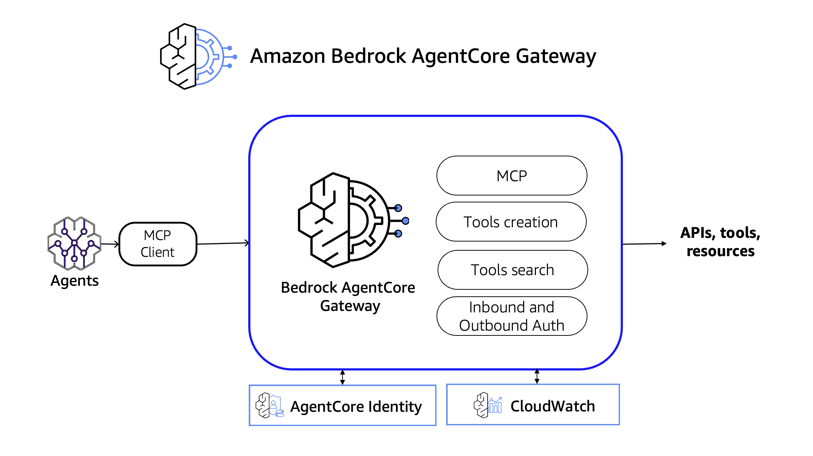
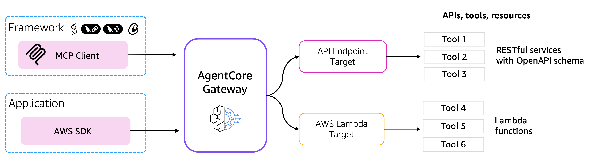
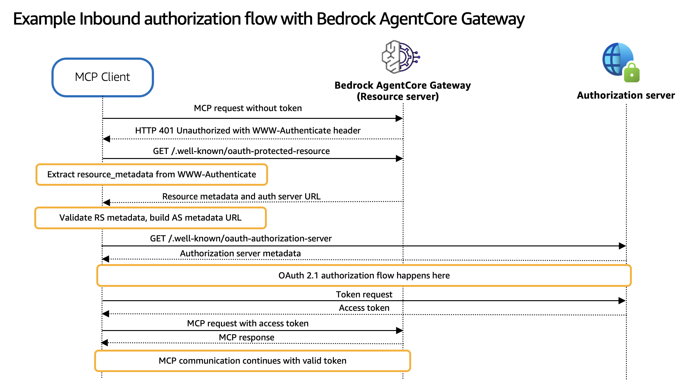
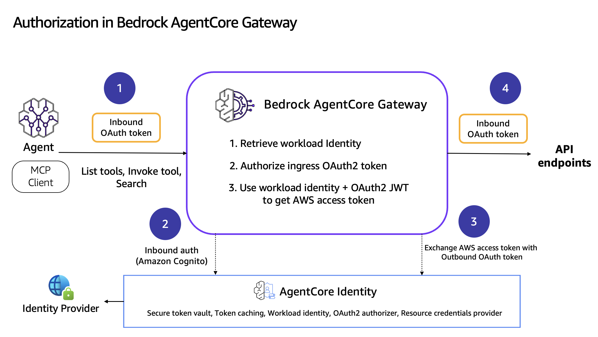
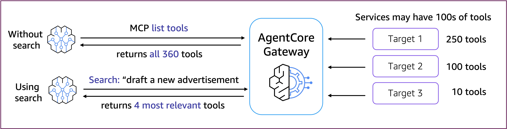

# Amazon Bedrock AgentCore Gateway

## 개요
Bedrock AgentCore Gateway는 고객이 인프라나 호스팅을 관리할 필요 없이 기존 API와 Lambda 함수를 완전 관리형 MCP 서버로 전환할 수 있는 방법을 제공합니다. 고객은 기존 API에 대한 OpenAPI 사양이나 Smithy 모델을 가져오거나 도구를 프론트하는 Lambda 함수를 추가할 수 있습니다. Gateway는 이러한 모든 도구에 걸쳐 통일된 Model Context Protocol(MCP) 인터페이스를 제공합니다. Gateway는 들어오는 요청과 대상 리소스에 대한 아웃바운드 연결 모두에 대해 안전한 액세스 제어를 보장하기 위해 이중 인증 모델을 사용합니다. 프레임워크는 두 가지 주요 구성 요소로 구성됩니다: 게이트웨이 대상에 액세스하려는 사용자를 검증하고 권한을 부여하는 Inbound Auth와 인증된 사용자를 대신하여 게이트웨이가 백엔드 리소스에 안전하게 연결할 수 있도록 하는 Outbound Auth입니다. 이러한 인증 메커니즘은 함께 사용자와 대상 리소스 간의 안전한 브리지를 만들어 IAM 자격 증명과 OAuth 기반 인증 플로우를 모두 지원합니다. Gateway는 MCP의 Streamable HTTP 전송 연결을 지원합니다.

## 개념 정의

Amazon Bedrock AgentCore Gateway를 시작하기 전에 몇 가지 중요한 개념을 정의해 보겠습니다:

* **Amazon Bedrock AgentCore Gateway**: 고객이 표준 MCP 작업(즉, listTools 및 invokeTool)을 실행하기 위해 MCP 클라이언트로 호출할 수 있는 HTTP 엔드포인트입니다. 고객은 boto3와 같은 AWS SDK를 사용하여 이 AmazonCore Gateway를 호출할 수도 있습니다.
* **Bedrock AgentCore Gateway Target**: 고객이 AmazonCore Gateway에 대상을 연결하는 데 사용하는 리소스입니다. 현재 AgentCore Gateway의 대상으로 다음 유형이 지원됩니다:
    * Lambda ARN
    * API 사양 → OpenAPI, Smithy
* **MCP Transport**: 클라이언트(LLM을 사용하는 애플리케이션)와 MCP 서버 간에 메시지가 이동하는 방식을 정의하는 메커니즘입니다. 현재 AgentCore Gateway는 전송으로 `Streamable HTTP 연결`만 지원합니다.

## 작동 방식

## 인바운드 및 아웃바운드 권한 부여
Bedrock AgentCore Gateway는 인바운드 및 아웃바운드 인증을 통해 안전한 연결을 제공합니다. 인바운드 인증의 경우 AgentCore Gateway는 호출 중에 전달된 OAuth 토큰을 분석하여 게이트웨이의 도구에 대한 액세스를 허용하거나 거부할지 결정합니다. 도구가 외부 리소스에 액세스해야 하는 경우 AgentCore Gateway는 API 키, IAM 또는 OAuth 토큰을 통한 아웃바운드 인증을 사용하여 외부 리소스에 대한 액세스를 허용하거나 거부할 수 있습니다.

인바운드 권한 부여 플로우 중에 에이전트 또는 MCP 클라이언트는 OAuth 액세스 토큰(사용자의 IdP에서 생성됨)을 추가하여 AgentCore Gateway의 MCP 도구를 호출합니다. 그러면 AgentCore Gateway가 OAuth 액세스 토큰을 검증하고 인바운드 권한 부여를 수행합니다.

AgentCore Gateway에서 실행되는 도구가 외부 리소스에 액세스해야 하는 경우 OAuth는 Gateway 대상에 대한 리소스 자격 증명 공급자를 사용하여 다운스트림 리소스의 자격 증명을 검색합니다. AgentCore Gateway는 권한 부여 자격 증명을 호출자에게 전달하여 다운스트림 API에 액세스할 수 있도록 합니다.

### MCP 권한 부여 및 Gateway

Amazon Bedrock AgentCore Gateway는 들어오는 MCP 도구 호출의 권한 부여를 위해 [MCP 권한 부여 사양](https://modelcontextprotocol.io/specification/2025-06-18/basic/authorization)을 준수합니다.

### AgentCore Gateway와 AgentCore Identity 통합

### 도구 검색
Amazon Bedrock AgentCore Gateway에는 에이전트와 개발자가 자연어 쿼리를 통해 가장 관련성 높은 도구를 찾을 수 있도록 도와주는 강력한 내장 의미 검색 기능이 포함되어 있으며, 도구 선택을 위해 에이전트에 전달되는 **컨텍스트를 줄입니다**. 이 검색 기능은 의미 매칭을 위해 벡터 임베딩을 활용하는 사전 구축된 도구로 구현됩니다. 사용자는 CreateGateway API를 통해 옵트인하여 Gateway 생성 중에 이 기능을 활성화할 수 있습니다. 활성화되면 후속 CreateTarget 작업이 자동으로 대상 도구에 대한 벡터 임베딩 생성을 트리거합니다. 이 과정에서 임베딩이 생성되는 동안 CreateTarget 응답 STATUS 필드는 "UPDATING"을 나타냅니다.

### 튜토리얼 세부 정보

| 정보                 | 세부 사항                                                    |
|:---------------------|:----------------------------------------------------------|
| 튜토리얼 유형           | 대화형                                                      |
| AgentCore 구성 요소    | AgentCore Gateway, AgentCore Identity                     |
| 에이전트 프레임워크      | Strands Agents                                            |
| LLM 모델             | Anthropic Claude Sonnet 3.7, Amazon Nova Pro              |
| 튜토리얼 구성 요소      | AgentCore Gateway 생성 및 AgentCore Gateway 호출            |
| 튜토리얼 분야          | 교차 분야                                                   |
| 예제 복잡성           | 쉬움                                                       |
| 사용된 SDK           | boto3                                                     |

## 튜토리얼 아키텍처

### 튜토리얼 주요 기능

#### 안전한 도구 액세스

Amazon Bedrock AgentCore Gateway는 들어오는 MCP 도구 호출의 권한 부여를 위해 [MCP 권한 부여 사양](https://modelcontextprotocol.io/specification/2025-06-18/basic/authorization)을 준수합니다.
Amazon Bedrock AgentCore Gateway는 또한 Gateway에서 나가는 호출의 권한 부여를 지원하기 위해 2가지 옵션을 제공합니다:
* API 키 사용 또는
* OAuth 액세스 토큰 사용
Amazon Bedrock AgentCore Identity의 Credentials provider API를 사용하여 권한 부여를 구성하고 AgentCore Gateway Target에 연결할 수 있습니다.
각 Target(AWS Lambda, Smithy 및 OpenAPI)은 자격 증명 공급자에 연결할 수 있습니다.

#### 통합

Bedrock AgentCore Gateway는 다음과 통합됩니다:
* Bedrock AgentCore Identity
* Bedrock AgentCore Runtime

### 사용 사례

* MCP 도구를 호출하는 실시간 대화형 에이전트
* 다양한 IdP를 사용한 인바운드 및 아웃바운드 권한 부여
* AWS Lambda 함수, Open API 및 Smithy 모델의 MCP화
* MCP 도구 검색

### 이점

* Gateway는 AI 에이전트 개발 및 배포를 단순화하는 여러 주요 이점을 제공합니다: 인프라 관리 불필요
* 호스팅 걱정이 없는 완전 관리형 서비스. Amazon Bedrock AgentCore가 모든 인프라를 자동으로 처리합니다.
* 통합 인터페이스: 모든 도구에 대한 단일 MCP 프로토콜로 에이전트 코드에서 여러 API 형식과 인증 메커니즘을 관리하는 복잡성을 제거합니다.
* 내장 인증: OAuth 및 자격 증명 관리가 추가 개발 노력 없이 토큰 수명 주기, 새로 고침 및 안전한 저장을 처리합니다.
* 자동 확장: 수동 개입이나 용량 계획 없이 다양한 워크로드를 처리하기 위해 수요에 따라 자동으로 확장됩니다.
* 엔터프라이즈 보안: 암호화, 액세스 제어 및 감사 로깅을 포함한 엔터프라이즈급 보안 기능으로 안전한 도구 액세스를 보장합니다.

## 튜토리얼 개요

이 튜토리얼에서는 다음 기능을 다룹니다:

- [AWS Lambda 함수를 MCP 도구로 변환](01-transform-lambda-into-mcp-tools)
- [API를 MCP 도구로 변환](02-transform-apis-into-mcp-tools)
- [MCP 도구 검색](03-search-tools)
