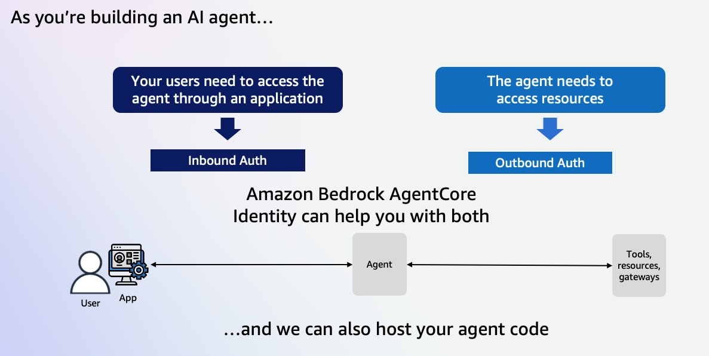
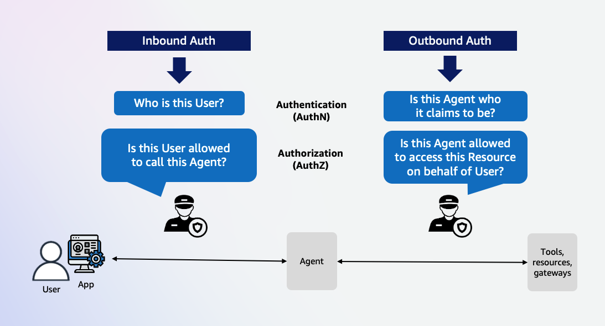

# Amazon Bedrock AgentCore Identity 시작하기

## 소개

Amazon Bedrock AgentCore Identity는 AI 에이전트와 자동화된 워크로드를 위해 특별히 설계된 포괄적인 ID 및 자격 증명 관리 서비스입니다. 사용자가 에이전트를 호출하고 에이전트가 사용자를 대신하여 외부 리소스와 서비스에 액세스할 수 있도록 하는 안전한 인증, 권한 부여 및 자격 증명 관리 기능을 제공하면서 엄격한 보안 제어와 감사 추적을 유지합니다. 에이전트 ID는 업계 표준 워크로드 ID 패턴과의 호환성을 유지하면서 에이전트별 기능을 가능하게 하는 특수 속성을 가진 워크로드 ID로 구현됩니다. 이 서비스는 Amazon Bedrock AgentCore와 기본적으로 통합되어 에이전트 애플리케이션에 대한 포괄적인 ID 및 자격 증명 관리를 제공합니다.

## AgentCore Identity에서 지원하는 인증 유형

AgentCore Identity를 사용하면 AgentCore Runtime의 에이전트나 도구를 호출하는 사용자와 애플리케이션에 대한 인바운드 액세스(인바운드 인증)를 검증하거나 AgentCore Gateway 대상에 대한 액세스를 검증할 수 있습니다. 또한 에이전트나 Gateway 대상에서 외부 서비스로의 안전한 아웃바운드 액세스(아웃바운드 인증)를 제공합니다. 기존 ID 공급자(예: Amazon Cognito)와 통합하면서 독립적으로 또는 사용자를 대신하여(OAuth를 통해) 작동하는 에이전트에 대한 권한 경계를 적용합니다.

    
    

* 인바운드: 인바운드 인증은 사용자가 에이전트나 도구를 호출할 수 있는 액세스 권한을 부여하는 데 사용됩니다. 사용자가 애플리케이션 내에서 에이전트를 호출하려는 시나리오를 고려해보세요. 해당 사용자는 에이전트를 호출할 권한이 있어야 하고 에이전트는 작업을 수행할 때 사용자가 누구인지 유지해야 합니다. 인바운드 인증은 AWS IAM 또는 OAuth라는 두 가지 인증 메커니즘을 지원합니다. OAuth는 에이전트 빌더가 사용자에게 IAM 권한을 부여하지 않고도 에이전트를 호출할 수 있는 방법을 제공합니다.
  
* 아웃바운드: 아웃바운드 인증은 에이전트나 AgentCore Gateway가 사용자를 대신하여 AWS 서비스나 외부 리소스에 액세스할 수 있는 권한을 부여하는 데 사용됩니다. AgentCore Identity는 제공된 IAM 실행 역할을 사용하여 AWS 리소스에 액세스합니다. 외부 리소스에는 OAuth 2-leg 또는 3-leg 액세스 플로우가 사용됩니다.