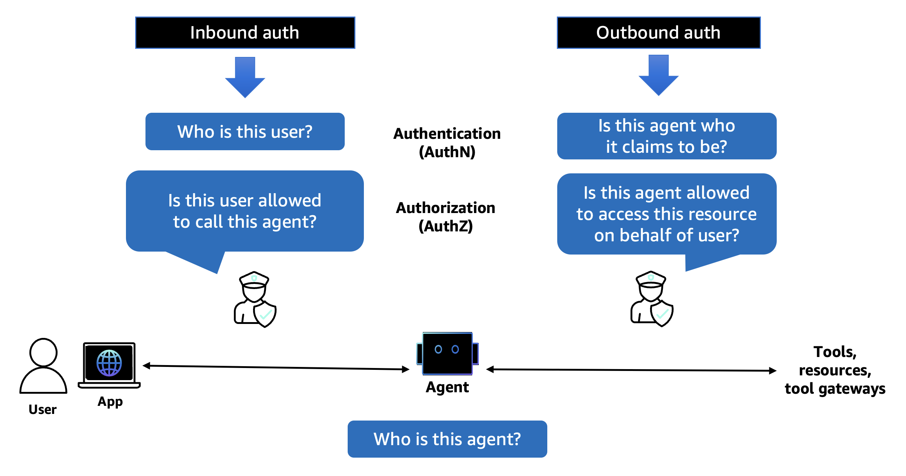

# Amazon Bedrock AgentCore Identity

## 개요

Amazon Bedrock AgentCore Identity는 AI 에이전트와 자동화된 워크로드를 위해 특별히 설계된 포괄적인 ID 및 자격 증명 관리 서비스입니다. 사용자가 에이전트를 호출하고 에이전트가 사용자를 대신하여 외부 리소스와 서비스에 액세스할 수 있도록 하는 안전한 인증, 권한 부여 및 자격 증명 관리 기능을 제공하면서 엄격한 보안 제어와 감사 추적을 유지합니다.

AgentCore Identity는 AI 에이전트 배포의 근본적인 과제를 해결합니다: 보안이나 사용자 경험을 손상시키지 않으면서 에이전트가 여러 서비스에 걸쳐 사용자별 데이터에 안전하게 액세스할 수 있도록 하는 것입니다. 이 서비스는 에이전트가 검증 가능한 사용자 컨텍스트를 전달하면서 자신으로 인증하는 **가장이 아닌 위임** 원칙에 따라 작동합니다.

## 주요 기능

- **인바운드 인증**: 에이전트나 도구를 호출하는 사용자와 애플리케이션에 대한 액세스 검증
- **아웃바운드 인증**: 에이전트가 사용자를 대신하여 외부 서비스에 안전하게 액세스
- **OAuth 통합**: 2-legged 및 3-legged OAuth 플로우 지원
- **AWS IAM 통합**: AWS ID 및 액세스 관리와의 네이티브 통합
- **제로 트러스트 보안**: 소스나 이전 신뢰 관계에 관계없이 모든 요청 검증
- **크로스 플랫폼 지원**: AWS, 다른 클라우드 공급자 및 온프레미스 환경에서 작동

## 인증 유형

AgentCore Identity는 두 가지 주요 인증 패턴을 지원합니다:

### 인바운드 인증
AgentCore Runtime 또는 Gateway 대상의 에이전트나 도구를 호출하는 사용자와 애플리케이션에 대한 액세스를 검증합니다. 지원 사항:
- **AWS IAM**: 직접 IAM 기반 액세스 제어
- **OAuth**: 최종 사용자에게 IAM 권한을 요구하지 않는 토큰 기반 인증

### 아웃바운드 인증
에이전트가 사용자를 대신하여 AWS 서비스와 외부 리소스에 액세스할 수 있도록 합니다:
- **AWS 리소스**: AWS 서비스 액세스를 위한 IAM 실행 역할 사용
- **외부 서비스**: OAuth 2-legged(클라이언트 자격 증명) 및 3-legged(권한 부여 코드) 플로우

## 작동 방식

AgentCore Identity는 여러 신뢰 도메인에 걸쳐 인증과 권한 부여를 조율하는 포괄적인 워크플로를 구현합니다:

1. **사용자 인증**: 사용자가 기존 ID 공급자(Cognito, Auth0 등)를 통해 인증
2. **에이전트 권한 부여**: 애플리케이션이 사용자 토큰으로 에이전트 액세스 요청
3. **토큰 교환**: AgentCore Identity가 사용자 토큰을 검증하고 워크로드 액세스 토큰 발급
4. **리소스 액세스**: 에이전트가 워크로드 토큰을 사용하여 AWS 및 타사 리소스에 액세스
5. **위임 및 감사**: 모든 작업이 사용자 컨텍스트와 감사 추적을 유지

자세한 기술 정보는 [AgentCore Identity 작동 방식](02-how_it_works.md)을 참조하세요.

## 튜토리얼 예제

이 튜토리얼에는 다양한 인증 시나리오를 보여주는 4가지 실습 예제가 포함되어 있습니다:

| 예제 | 유형 | 설명 |
|---------|------|-------------|
| **[인바운드 인증 예제](03-Inbound%20Auth%20example)** | 인바운드 | Strands 에이전트와 Bedrock 모델을 사용한 사용자 인증 |
| **[아웃바운드 인증 예제](04-Outbound%20Auth%20example)** | 아웃바운드 | Strands와 OpenAI를 사용한 외부 서비스에 대한 에이전트 액세스 |
| **[3-Legged OAuth](05-Outbound_Auth_3lo)** | 아웃바운드 | Cognito와 Google을 사용한 3-legged OAuth 플로우로 사용자 위임 액세스 |
| **[GitHub 통합](06-Outbound_Auth_Github)** | 아웃바운드 | 3-legged OAuth 인증을 사용한 GitHub API 액세스 |

각 예제에는 다음이 포함됩니다:
- 완전한 Jupyter 노트북 안내
- 단계별 설정 지침
- 코드 샘플 및 설명
- 모범 사례 및 보안 고려 사항

## 시작하기

1. **소개 읽기**: [시작하기](01-getting_started.md)로 AgentCore Identity 개념 이해
2. **워크플로 이해**: 기술적 세부 사항은 [작동 방식](02-how_it_works.md) 검토
3. **예제 선택**: 인증 요구 사항에 따라 튜토리얼 예제 선택:
   - 에이전트에 대한 사용자 인증: **인바운드 인증 예제**로 시작
   - 외부 서비스에 대한 에이전트 액세스: **아웃바운드 인증 예제** 시도
   - 사용자 위임 액세스 패턴: **3-Legged OAuth** 또는 **GitHub 통합** 탐색

## 주요 이점

- **향상된 보안**: 세밀한 액세스 제어를 통한 제로 트러스트 인증
- **사용자 경험**: 반복적인 인증 프롬프트 없이 원활한 액세스
- **감사 및 규정 준수**: 모든 에이전트 작업에 대한 완전한 감사 추적
- **프레임워크 독립적**: 모든 에이전트 프레임워크(Strands, LangGraph, CrewAI 등)와 작동
- **확장 가능**: 여러 ID 공급자를 지원하는 엔터프라이즈 준비
- **표준 기반**: OAuth 2.0, OIDC 및 업계 보안 표준을 기반으로 구축

## 아키텍처 통합

AgentCore Identity는 다른 AgentCore 구성 요소와 원활하게 통합됩니다:

- **AgentCore Runtime**: 호스팅된 에이전트에 대한 인증 제공
- **AgentCore Gateway**: 도구 및 외부 API에 대한 액세스 보안
- **AgentCore Memory**: 사용자별 메모리 저장소에 대한 안전한 액세스 유지
- **타사 서비스**: 외부 API 및 서비스와의 안전한 통합 지원

## 다음 단계

튜토리얼을 완료한 후 다음을 수행할 수 있습니다:
- AgentCore Identity를 기존 ID 인프라와 통합
- 사용자 정의 OAuth 공급자 및 범위 구성
- 고급 보안 정책 및 액세스 제어 구현
- 프로덕션 준비 에이전트 인증 워크플로 배포
- 여러 서비스와 플랫폼에 걸쳐 안전한 에이전트 인프라 확장
