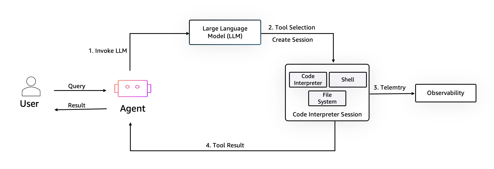

# Amazon Bedrock AgentCore Code Interpreter

## 개요
Amazon Bedrock AgentCore Code Interpreter는 AI 에이전트가 직접 코드를 작성하고 실행하여 엔드투엔드 작업을 완료할 수 있는 안전하고 서버리스 환경으로, 복잡한 데이터 분석, 시뮬레이션 실행, 시각화 생성 및 프로그래밍 작업 자동화를 수행할 수 있도록 합니다.

## 작동 방식

코드 실행 샌드박스는 코드 인터프리터, 셸 및 파일 시스템이 있는 격리된 환경을 생성하여 에이전트가 사용자 쿼리를 안전하게 처리할 수 있도록 합니다. 대규모 언어 모델이 도구 선택을 도운 후 이 세션 내에서 코드가 실행되고 합성을 위해 사용자 또는 에이전트에게 반환됩니다.

## 주요 기능

### 환경의 세션

실행 간에 세션을 지속하는 능력

### VPC 지원 및 인터넷 액세스

VPC 연결 및 외부 인터넷 액세스를 포함한 엔터프라이즈급 기능 제공

### 여러 사전 구축된 환경 런타임

Python, NodeJS 및 TypeScript를 포함한 여러 사전 구축된 런타임(곧 출시 예정: 사용자 정의 라이브러리가 있는 사용자 정의 런타임 코드 실행 엔진 지원)

### 통합

Amazon Bedrock AgentCore Code Interpreter는 통합 SDK를 통해 다른 Amazon Bedrock AgentCore 기능과 통합됩니다:

- Amazon Bedrock AgentCore Runtime
- Amazon Bedrock AgentCore Identity
- Amazon Bedrock AgentCore Memory
- Amazon Bedrock AgentCore Observability

이러한 통합은 개발 프로세스를 단순화하고 강력한 코드 실행 기능을 갖춘 AI 에이전트를 구축, 배포 및 관리하기 위한 포괄적인 플랫폼을 제공하는 것을 목표로 합니다.

### 사용 사례

Amazon Bedrock AgentCore Code Interpreter는 다음을 포함한 광범위한 애플리케이션에 적합합니다:

- 코드 실행 및 검토
- 데이터 분석 및 시각화

## 튜토리얼 개요

이 튜토리얼에서는 다음 기능을 다룹니다:

- [Amazon Bedrock AgentCore Code Interpreter를 사용한 파일 작업](01-file-operations-using-code-interpreter)
- [Amazon Bedrock AgentCore Code Interpreter를 사용한 에이전트와의 코드 실행](02-code-execution-with-agent-using-code-interpreter)
- [Amazon Bedrock AgentCore Code Interpreter를 사용한 AI 에이전트와의 고급 데이터 분석](03-advanced-data-analysis-with-agent-using-code-interpreter)
- [Amazon Bedrock AgentCore Code Interpreter를 사용한 명령 실행](04-run-commands-using-code-interpreter)
