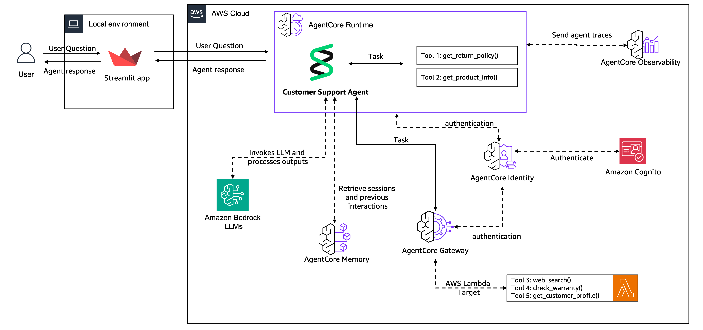

# AgentCore를 사용한 엔드투엔드 고객 지원 에이전트

이 튜토리얼에서는 Amazon Bedrock AgentCore 서비스를 사용하여 고객 지원 에이전트를 프로토타입에서 프로덕션으로 이동시킵니다.

## 구축할 내용

간단한 프로토타입으로 시작하여 확장 가능하고 안전한 샘플 애플리케이션으로 발전하는 완전한 고객 지원 시스템입니다.

최종 시스템은 메모리, 공유 도구 및 웹 인터페이스를 통해 실제 고객 대화를 처리합니다.

> [!IMPORTANT]
> 여기에 제공된 예제는 교육 목적입니다. AgentCore의 다양한 서비스가 에이전트 사용 사례를 프로토타입에서 프로덕션으로 마이그레이션하는 과정에서 어떻게 사용되는지 보여줍니다. 따라서 프로덕션 환경에서 직접 사용하기 위한 것이 아닙니다.

**여정 개요:**
- 기본 에이전트 프로토타입으로 시작 (20분)
- 세션 간 대화 메모리 추가 (20분)
- 여러 에이전트 간에 도구를 안전하게 공유 (30분)
- 모니터링과 함께 프로덕션에 배포 (30분)
- 고객 대면 웹 앱 구축 (20분)

## 아키텍처 개요

이 튜토리얼의 5개 실습을 완료하면 다음 아키텍처를 생성하게 됩니다

    

## 전제 조건

- Bedrock 액세스가 있는 AWS 계정
- Python 3.10+
- 구성된 AWS CLI
- Bedrock에서 활성화된 Claude 3.7 Sonnet

## 실습

### 실습 1: 에이전트 프로토타입 생성
세 가지 핵심 도구를 가진 고객 지원 에이전트의 프로토타입을 구축합니다:
- 반품 정책 조회
- 제품 정보 검색
- 문제 해결을 위한 웹 검색

**학습 내용:** Strands Agents와 도구 통합을 사용한 기본 에이전트 생성

### 실습 2: 메모리 추가
"금붕어 에이전트"를 대화 간에 고객을 기억하는 에이전트로 변환합니다.
- 지속적인 대화 기록
- 고객 선호도 추출
- 세션 간 컨텍스트 인식

**학습 내용:** 단기 및 장기 지속성을 위한 AgentCore Memory

### 실습 3: Gateway 및 Identity로 확장
로컬 도구에서 공유된 엔터프라이즈 준비 서비스로 이동합니다.
- 중앙 집중식 도구 관리
- JWT 기반 인증
- 기존 AWS Lambda 함수와의 통합

**학습 내용:** 안전한 도구 공유를 위한 AgentCore Gateway 및 AgentCore Identity

### 실습 4: 프로덕션에 배포
완전한 관찰 가능성으로 실제 트래픽을 처리하도록 에이전트를 배포합니다.
- 완전 관리형 배포
- 세션 연속성 및 세션 격리
- CloudWatch 관찰 가능성 통합

**학습 내용:** 프로덕션급 관찰 가능성을 갖춘 AgentCore Runtime

### 실습 5: 고객 인터페이스 구축
고객이 실제로 사용할 수 있는 웹 앱을 만듭니다.
- Streamlit 기반 채팅 인터페이스
- 실시간 응답 스트리밍
- 세션 관리 및 인증

**학습 내용:** 안전한 에이전트 엔드포인트와의 프론트엔드 통합

## 시작하기

1. 이 저장소 복제
2. 종속성 설치: `pip install -r requirements.txt`
3. AWS 자격 증명 구성
4. [실습 1](lab-01-create-an-agent.ipynb)로 시작

각 실습은 이전 실습을 기반으로 하지만 개념을 이해한다면 앞으로 건너뛸 수 있습니다.

## 아키텍처 진화

간단한 로컬 에이전트에서 프로덕션 시스템으로 아키텍처가 성장하는 것을 지켜보세요:

**실습 1:** 내장 도구가 있는 로컬 에이전트  
**실습 2:** 지속성을 위한 에이전트 + AgentCore Memory  
**실습 3:** 공유 도구를 위한 에이전트 + AgentCore Memory + AgentCore Gateway 및 AgentCore Identity  
**실습 4:** AgentCore Runtime에 배포 및 AgentCore Observability로 관찰 가능성  
**실습 5:** 인증이 있는 고객 대면 애플리케이션

구축할 준비가 되셨나요? [실습 1로 시작 →](lab-01-create-an-agent.ipynb)