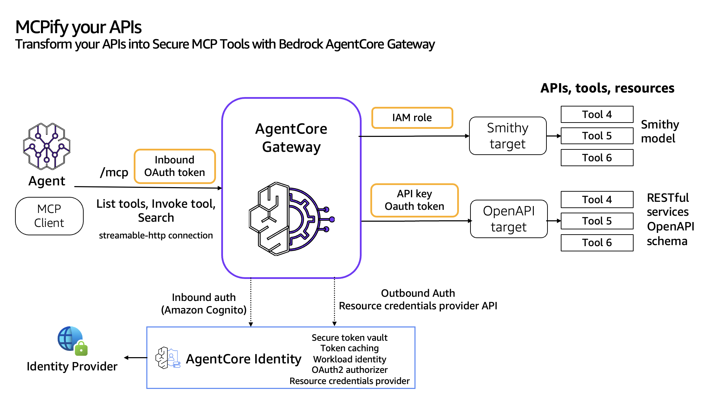
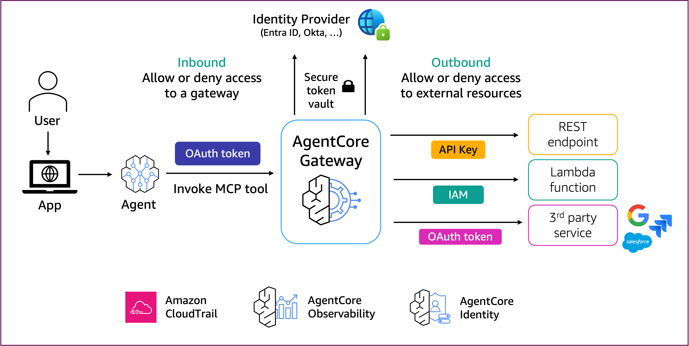

# Amazon Bedrock AgentCore Gateway를 사용하여 API에서 MCP 도구 구현

## 개요
Bedrock AgentCore Gateway는 고객이 인프라나 호스팅을 관리할 필요 없이 기존 API(OpenAPI 및 Smithy)를 완전 관리형 MCP 서버로 전환할 수 있는 방법을 제공합니다. 고객은 기존 OpenAPI 및 Smithy 사양을 가져와서 도구를 변환할 수 있습니다. Gateway는 이러한 모든 도구에 걸쳐 통일된 Model Context Protocol(MCP) 인터페이스를 제공합니다. Gateway는 들어오는 요청과 대상 리소스에 대한 아웃바운드 연결 모두에 대해 안전한 액세스 제어를 보장하기 위해 이중 인증 모델을 사용합니다. 프레임워크는 두 가지 주요 구성 요소로 구성됩니다: 게이트웨이 대상에 액세스하려는 사용자를 검증하고 권한을 부여하는 Inbound Auth와 API 키, OAuth 토큰 및 AWS IAM 역할을 사용하여 인증된 사용자를 대신하여 게이트웨이가 백엔드 API에 안전하게 연결할 수 있도록 하는 Outbound Auth입니다.

## 개념 정의

Amazon Bedrock AgentCore Gateway를 시작하기 전에 몇 가지 중요한 개념을 정의해 보겠습니다:
OpenAPI 또는 Smithy API를 그룹화하고 Bedrock AgentCore Gateway Target을 생성할 수 있습니다. 대상은 API를 논리적으로 그룹화하고 AmazonCore Gateway에 연결하는 데 사용하는 리소스입니다.

## API를 Gateway 대상으로 그룹화

다음은 API를 Gateway 대상으로 그룹화하는 모범 사례입니다:
* 마이크로서비스 패러다임에 적용되는 Domain Driven Design 원칙과 유사하게 에이전트 애플리케이션의 비즈니스 도메인을 기반으로 MCP 도구를 그룹화합니다.
* Gateway 대상에 대한 아웃바운드 권한 부여를 위해 하나의 리소스 자격 증명 공급자만 연결할 수 있습니다. 아웃바운드 권한 부여자를 기반으로 도구를 그룹화합니다.
* API 유형(즉, OpenAPI, Smithy 또는 다른 엔터프라이즈 API에 대한 브리지 역할을 하는 AWS Lambda)을 기반으로 API를 그룹화합니다.

## 모범 사례

1. 문서 품질 가이드라인
- 각 API 엔드포인트와 리소스에 대해 명확하고 설명적인 요약 작성
- 목적과 기능을 설명하는 자연어 설명 사용
- 설명에 실제 사용 사례 포함
- 필요하지 않은 경우 기술 전문 용어 피하기
- 문서 전체에서 일관된 용어 사용 보장

2. 스키마 문서화
- 모든 필드에 대한 자세한 설명 제공
- 필드 제약 조건 및 검증 규칙 포함
- 데이터 유형을 정확하게 문서화
- 복잡한 데이터 구조에 대한 예제 추가
- 다른 스키마 간의 관계 설명

3. OpenAPI 사양 모범 사례
- OpenAPI 린터를 사용하여 사양 검증
- 적절한 의미 버전 관리 보장
- 완전한 요청/응답 예제 포함
- 오류 응답 및 코드 문서화
- 보안 스키마 정의 추가

4. 도구 검색 최적화
- 설명에 관련 키워드를 자연스럽게 포함
- 각 API를 언제 사용할지에 대한 컨텍스트 제공
- 대안적 접근 방식이나 관련 엔드포인트 문서화
- 비즈니스 도메인 용어 포함

5. API 추출 가이드라인
- 에이전트 작업에 필요한 핵심 기능 식별
- 사용 사례를 기반으로 한 집중된 API 하위 집합 생성
- 추출된 API 간의 의미적 관계 유지
- 보안 정의 및 공통 스키마 보존
- 추출된 구성 요소 간의 종속성 문서화

6. 모놀리식 API 추출 프로세스:
- 전체 OpenAPI 사양 검토
- 에이전트 사용 사례를 특정 엔드포인트 및 인증 요구 사항에 매핑
- 관련 경로 및 스키마 추출
- 구성 요소 종속성 유지
- 추출된 사양 검증
- 의미 검색 효과 테스트

API가 발전함에 따라 문서를 정기적으로 검토하고 업데이트하여 에이전트의 품질과 정확성을 유지하는 것을 잊지 마세요.

## 인바운드 및 아웃바운드 권한 부여
Bedrock AgentCore Gateway는 인바운드 및 아웃바운드 인증을 통해 안전한 연결을 제공합니다. 인바운드 인증의 경우 AgentCore Gateway는 호출 중에 전달된 OAuth 토큰을 분석하여 게이트웨이의 도구에 대한 액세스를 허용하거나 거부할지 결정합니다. 도구가 외부 리소스에 액세스해야 하는 경우 AgentCore Gateway는 API 키, IAM 또는 OAuth 토큰을 통한 아웃바운드 인증을 사용하여 외부 리소스에 대한 액세스를 허용하거나 거부할 수 있습니다.

인바운드 권한 부여 플로우 중에 에이전트 또는 MCP 클라이언트는 OAuth 액세스 토큰(사용자의 IdP에서 생성됨)을 추가하여 AgentCore Gateway의 MCP 도구를 호출합니다. 그러면 AgentCore Gateway가 OAuth 액세스 토큰을 검증하고 인바운드 권한 부여를 수행합니다.

AgentCore Gateway에서 실행되는 도구가 외부 리소스에 액세스해야 하는 경우 OAuth는 Gateway 대상에 대한 리소스 자격 증명 공급자를 사용하여 다운스트림 리소스의 자격 증명을 검색합니다. AgentCore Gateway는 권한 부여 자격 증명을 호출자에게 전달하여 다운스트림 API에 액세스할 수 있도록 합니다.

### 튜토리얼 세부 정보

| 정보          | 세부 사항                                                   |
|:---------------------|:----------------------------------------------------------|
| 튜토리얼 유형        | 대화형                                               |
| AgentCore 구성 요소 | AgentCore Gateway, AgentCore Identity                     |
| 에이전트 프레임워크    | Strands Agents                                            |
| LLM 모델            | Anthropic Claude Sonnet 3.7, Amazon Nova Pro              |
| 튜토리얼 구성 요소  | AgentCore Gateway 생성 및 AgentCore Gateway 호출 |
| 튜토리얼 분야    | 교차 분야                                            |
| 예제 복잡성   | 쉬움                                                      |
| 사용된 SDK             | boto3                                                     |

## 튜토리얼 아키텍처

### 튜토리얼 주요 기능

* OpenAPI API를 MCP 도구로 변환
* Smithy 모델을 MCP 도구로 변환

### 튜토리얼 개요

이 튜토리얼에서는 다음 기능을 다룹니다:

- [OpenAPI를 MCP 도구로 변환](01-transform-openapi-into-mcp-tools)
- [Smithy 모델을 MCP 도구로 변환](02-transform-smithyapis-into-mcp-tools)
